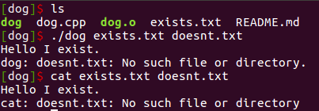

# dog
An alternative to `cat`.

# Usage

To print out a reflection of standard input:

	dog

To print out a file or multiple files

	dog [Flags] File 1 [File 2] ...

The following flags are accepted:

* -n: Show lines numbers
* -c: Show word count underneath each file
